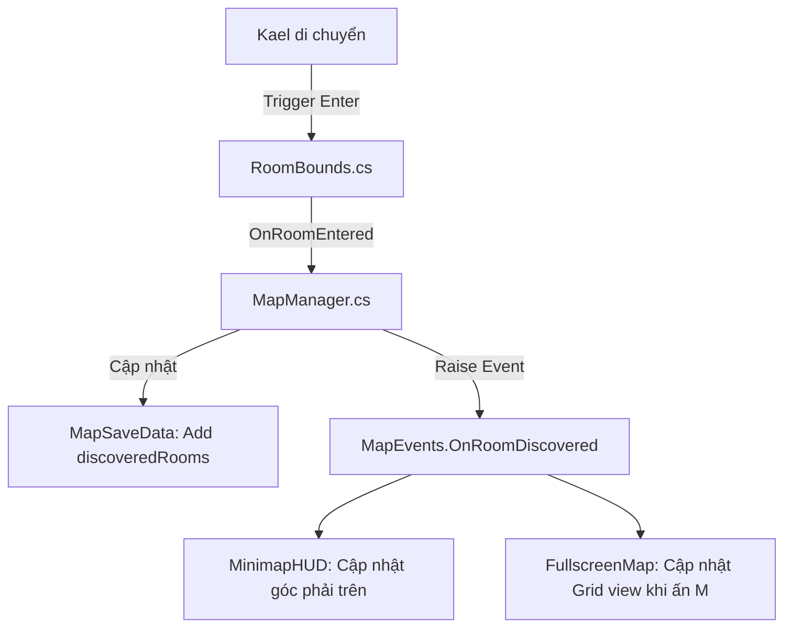

# KỸ THUẬT: HỆ THỐNG BẢN ĐỒ BLUEPRINT (MAP & MINIMAP)

## 1. Nhận định & Mục tiêu kiến trúc
- **Bài toán:** Metroidvania cần bản đồ dạng ô lưới (grid-based blueprint) hiển thị phòng đã khám phá, cửa chưa đi (`?`), ổ khóa kỹ năng (Wall Jump, Inversion, Anchor, Piston Boots), trạm lưu (Chrono Station), Monolith và vị trí tức thời của Kael.
- **Tiêu chí kỹ thuật:**
  - Tách bạch Data (`MapGridData`, `RoomDiscoveryState`) và Presentation (`MinimapHUD`, `FullscreenBlueprintMap`).
  - Dữ liệu khám phá lưu theo bitmask / danh sách ID phòng trong `SaveData`.
  - Khám phá phòng tự động kích hoạt khi Kael bước vào `RoomBounds` (Trigger 2D).
  - O(1) lookup phòng hiện tại; vẽ UI dạng procedural hoặc UI Canvas Pooling nhẹ, không sinh rác bộ nhớ (Zero GC per frame).

---

## 2. Mô hình Dữ liệu (Data Contract)

### 2.1. Cấu trúc Phòng trên bản đồ (`RoomMapNode`)
Mỗi phòng được định nghĩa trong ScriptableObject hoặc struct:
```csharp
[System.Serializable]
public struct RoomMapCoordinate
{
    public int zoneIndex;     // 1: Z1, 2: Z2, ...
    public Vector2Int gridPos; // Tọa độ ô trên bản đồ (vd: 0,0 là phòng bắt đầu)
    public Vector2Int size;    // Kích thước ô (1x1, 2x1, 1x2, 2x2...)
}

public enum RoomDoorDirection { North, South, East, West }

[System.Serializable]
public struct RoomDoorInfo
{
    public RoomDoorDirection direction;
    public Vector2Int localOffset; // Tọa độ cửa tương đối so với gridPos
    public bool isLocked;
    public AbilityFlags requiredAbility; // Cờ kỹ năng cần để mở (nếu là cửa khóa)
    public string targetRoomId;
}

[System.Serializable]
public class RoomMapDefinition
{
    public string roomId;              // vd: "Z1_R01"
    public string displayName;         // vd: "Foundry Entrance"
    public RoomMapCoordinate coordinate;
    public List<RoomDoorInfo> doors;
    public bool hasChronoStation;
    public bool hasMonolith;
    public bool hasBoss;
}
```

### 2.2. Trạng thái khám phá trong SaveData (`MapSaveData`)
Tích hợp vào `SaveData.cs`:
```csharp
[System.Serializable]
public class MapSaveData
{
    // Danh sách ID các phòng đã bước vào
    public HashSet<string> discoveredRooms = new HashSet<string>();
    
    // Bitmask hoặc danh sách ID các cửa đã mở khóa
    public HashSet<string> unlockedDoorIds = new HashSet<string>();
}
```

---

## 3. Luồng xử lý (Flow & Architecture)



### 3.1. Minimap HUD (Góc trên màn hình)
- Hiển thị cửa sổ 5x5 hoặc 7x7 ô xung quanh phòng hiện tại.
- Kael hiển thị bằng icon tam giác nhấp nháy hoặc chấm sáng chỉ hướng facing.
- Tốc độ làm mới: Chỉ vẽ lại khi chuyển phòng hoặc khi mở cửa mới. Không tính toán lại collider/mesh mỗi frame.

### 3.2. Fullscreen Blueprint Map (Ấn phím `M`)
- Chế độ Blueprint Grid: Nền xanh kỹ thuật (Aether-punk cyan/navy), các đường nét kẻ grid 1px.
- Phòng đã đi qua: Viền sáng rõ nét, nền mờ.
- Cửa chưa đi: Dấu chấm hỏi `?` nhấp nháy.
- Ổ khóa: Icon kỹ năng tương ứng (Piston Boots, Wall Jump, Echo Anchor, Gravity Inversion).
- Hỗ trợ Pan (WASD / kéo chuột / cần analog) và Zoom (cuộn chuột / Trigger tay cầm).
- Đóng game tạm dừng thời gian (`Time.timeScale = 0`) khi mở bản đồ toàn màn hình.

---

## 4. Danh sách File triển khai

| Thao tác | File | Trách nhiệm |
|---|---|---|
| [NEW] | `Assets/Scripts/UI/Map/MapDefinitionData.cs` | SO định nghĩa toàn bộ tọa độ phòng theo thiết kế 5 khu |
| [NEW] | `Assets/Scripts/UI/Map/MapManager.cs` | Quản lý trạng thái phát hiện, đồng bộ với `GameSession` & `SaveService` |
| [NEW] | `Assets/Scripts/UI/Map/MinimapHUD.cs` | Renderer minimap nhỏ trên góc HUD |
| [NEW] | `Assets/Scripts/UI/Map/FullscreenMapView.cs` | Giao diện bản đồ toàn màn hình, pan/zoom, icon ổ khóa |
| [MODIFY] | `Assets/Scripts/Environment/RoomBounds.cs` | Bắn event đăng ký khi player bước vào phòng |
| [MODIFY] | `Assets/Scripts/Save/SaveData.cs` | Bổ sung `List<string> discoveredRooms` vào save model |
| [NEW] | `Assets/Tests/PlayMode/MapSystemTests.cs` | Test tự động: vào phòng -> mở bản đồ -> lưu -> load giữ nguyên |
