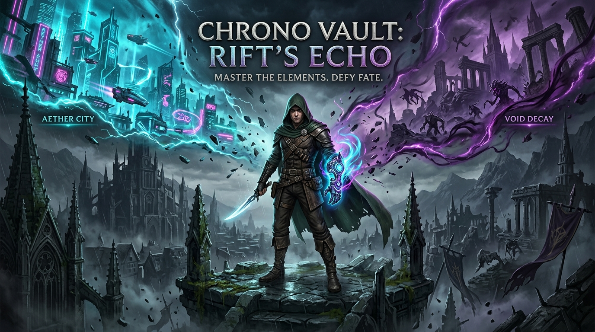
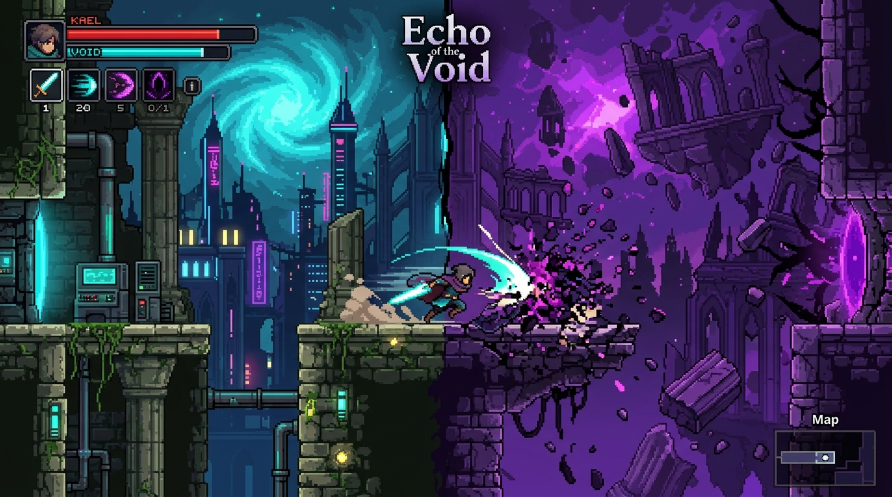
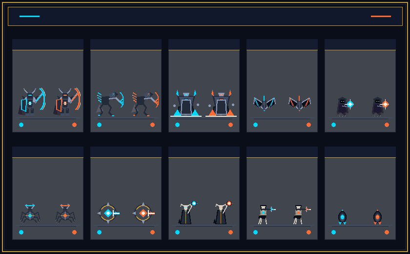
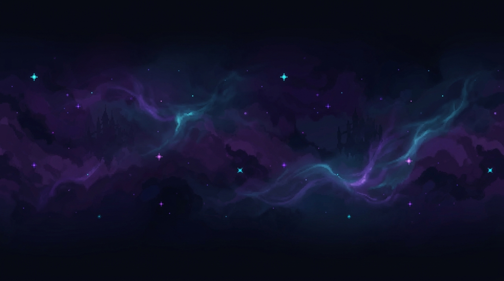

# 🌌 Echo of the Void

<p align="center">
  
</p>

<p align="center">
  <strong>A 2D Precision-Platformer & Metroidvania powered by Dual-Reality Mechanics</strong><br>
  <em>Built with Unity 6 (URP 2D) • High-octane Combat • 20 Campaign Levels</em>
</p>

<p align="center">
  
  
  
  
</p>

---

## 📖 Giới thiệu (Overview)

**Echo of the Void** là tựa game 2D hành động kết hợp Precision-Platformer và Metroidvania nhịp độ cao. Người chơi vào vai **Kael**, một chiến binh vô danh được trang bị **Găng Chrono (Chrono Gauntlet)** — cổ vật cho phép bẻ cong không thời gian và hoán đổi tức thì giữa hai tầng thực tại song song:

- 🔷 **Prime Reality (Thực tại Nguyên bản)**: Thế giới vật lý công nghệ Aether với các rào chắn laser, bệ nảy và công trình máy móc.
- 🔮 **Echo Reality (Thực tại Hư không)**: Chiều không gian Hư không tím thẫm với tàn tích trôi dạt, sinh vật bóng tối và các lối đi ẩn giấu.

<p align="center">
  
</p>

---

## ⚡ Tính năng nổi bật (Core Features)

### 1. Cơ chế Hoán đổi Thực tại (Dual-Reality Shift)
- Chuyển đổi trạng thái thực tại trong tích tắc bằng phím `Shift` / `LT`.
- Địa hình, bệ phóng, cửa năng lượng và kẻ địch thay đổi thuộc tính tương tác theo tầng thực tại tương ứng.

### 2. Hệ thống Di chuyển Chính xác (Precision Movement)
- **Fluid Controller**: Nhảy tường (Wall Jump), trượt tường mượt mà với anti-stick feel & wall coyote time.
- **Air Dash & Ghost Trail**: Lướt nhanh trên không trung kèm hiệu ứng bóng mờ (After-image).
- **Rail Grinding & Gravity Inversion**: Trượt cáp cao tốc và đảo ngược trọng lực tại các màn chơi nâng cao.

### 3. Chiến đấu Dark Fantasy & Năng lượng Chrono
- **Combo Chém 3 Nhịp**: Chuỗi đòn đánh kiếm cận chiến dứt khoát trên mặt đất và không trung.
- **Kỹ năng Cổ vật**:
  - *Resonance Strike*: Nhát chém sóng xung kích xuyên thực tại.
  - *Echo Anchor*: Tạo điểm neo không gian để dịch chuyển tức thời né đòn hiểm.

### 4. Hệ sinh thái Quái vật Đa dạng (Dark Fantasy Bestiary)
10 chủng loài quái vật mang tập tính và đòn tấn công đặc trưng:
- **Bone Skulker**: Bắn tỉa tầm xa từ vị trí cao.
- **Chrono Crawler**: Áp sát và phát nổ thời gian.
- **Void Weaver**: Phóng tơ khống chế không gian.
- **Rift Knight**: Hiệp sĩ giáp nặng với khiên chắn năng lượng.
- **Blight Gargoyle**: Quái thú săn mồi sà xuống từ không trung.
- **Sentinel Boss**: Trùm canh giữ cổ máy thời gian với các pha laser quét diện rộng.

<p align="center">
  
</p>

### 5. Đồ họa & Không gian Nghệ thuật (Art & Parallax)
- Hệ thống nền đa lớp (**3-Layer Parallax Background**) chuẩn phong cách Fantasy Gothic Aether-punk.
- Hiệu ứng ánh sáng thể tích URP 2D (Bloom, Dynamic Vignette, Chromatic Aberration).

<p align="center">
  
</p>

---

## 🎮 Bảng điều khiển (Controls)

| Hành động | Bàn phím (Keyboard) | Tay cầm (Gamepad Xbox/PS) |
|---|---|---|
| **Di chuyển** | `A` / `D` hoặc `←` / `→` | `D-Pad` / `Left Stick` |
| **Nhảy (Jump / Wall Jump)** | `Space` / `W` | `A` / `Cross` |
| **Lướt (Air Dash)** | `Left Shift` / `K` | `Right Trigger (RT)` / `R2` |
| **Hoán đổi Thực tại (Realm Shift)** | `Q` / `E` | `Left Bumper (LB)` / `L1` |
| **Tấn công (Melee Attack)** | `J` / Chuột trái | `X` / `Square` |
| **Kỹ năng Cổ vật (Ability)** | `U` / `I` | `Y` / `Triangle` |
| **Tương tác / Kích hoạt** | `F` | `B` / `Circle` |

---

## 🗺️ Tiến trình Chiến dịch (20 Campaign Levels)

Game được thiết kế hoàn chỉnh hệ thống tiến trình 20 cấp độ chia theo 4 vùng địa hình (Zones):
- **Zone 1 (Level 01 – 05)**: *Forgotten Gothic Ruins* — Làm quen với nhịp độ di chuyển và hoán đổi cơ bản.
- **Zone 2 (Level 06 – 10)**: *The Void Rift* — Cạm bẫy gai nhọn, quái vật tầm xa và câu đố địa hình nhảy tường.
- **Zone 3 (Level 11 – 15)**: *Aether Foundry* — Hệ thống cáp trượt (Rails), cửa năng lượng và quái vật khiên nặng.
- **Zone 4 (Level 16 – 20)**: *The Chrono Core* — Thử thách precision platformer đỉnh cao và trận quyết chiến Sentinel.

---

## 🛠️ Cài đặt & Khởi chạy (Getting Started)

### Yêu cầu hệ thống:
- **Unity**: `6000.0.32f1` (Unity 6 LTS) hoặc mới hơn.
- **Render Pipeline**: Universal Render Pipeline (URP).
- **Packages**: Cinemachine 2D, Input System, 2D Tilemap, Post-Processing.

### Các bước mở dự án:
1. Clone repository về máy:
   ```bash
   git clone https://github.com/HTL2910/Echo-of-the-Void.git
   ```
2. Mở **Unity Hub** -> chọn **Add project from disk** -> trỏ đến thư mục `Echo of the Void`.
3. Mở scene menu chính hoặc scene chơi thử:
   - `Assets/Scenes/MainMenu.unity` (Giao diện chính & chọn màn)
   - `Assets/Scenes/Prototype_Level1.unity` (Sân tập gameplay tổng hợp)
   - `Assets/Scenes/Level_01.unity` (Bắt đầu chiến dịch 20 màn)
4. Nhấn nút **Play** (`Ctrl+P` / `Cmd+P`) trên thanh công cụ Unity để trải nghiệm!

---

<p align="center">
  <sub>Developed with passion • Echo of the Void Team</sub>
</p>
